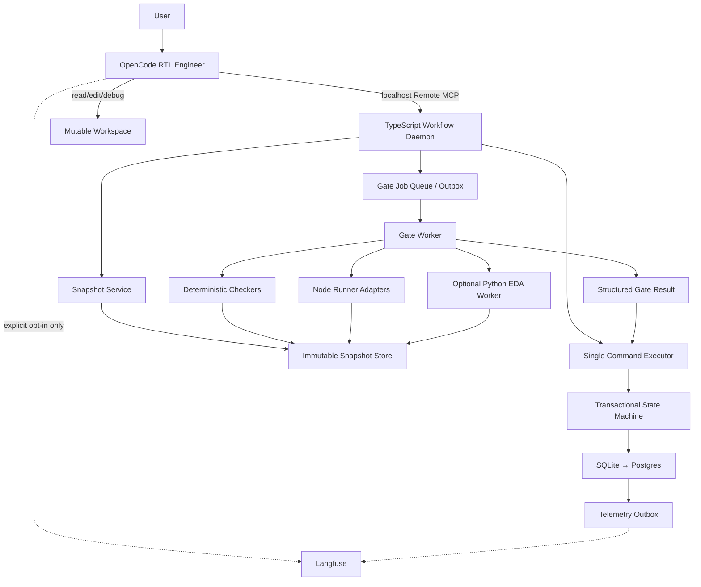
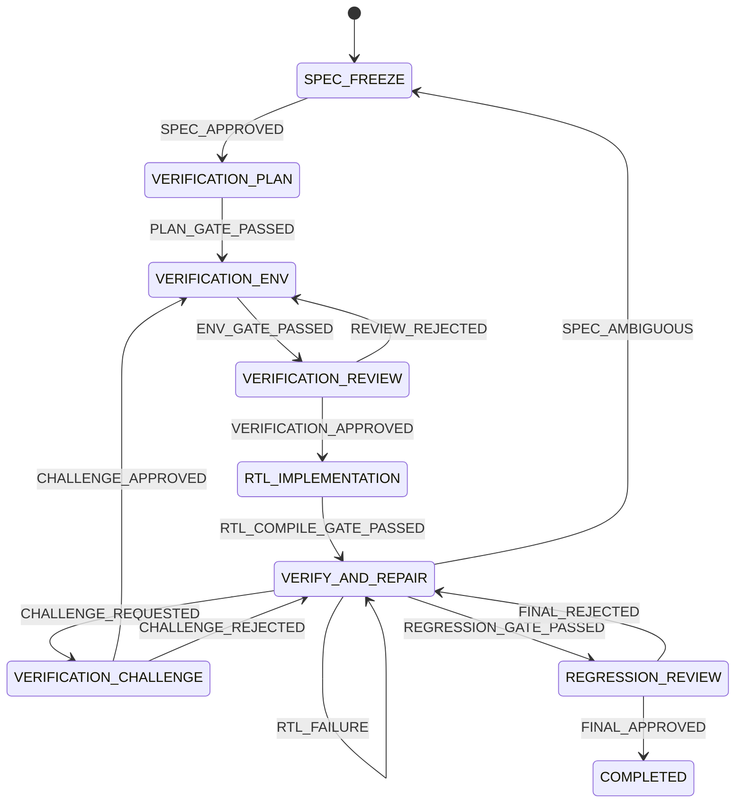

# OpenCode RTL Agent：最终 High Level Design

状态：Revised implementation baseline  
日期：2026-07-14  
适用范围：单用户、本地工作区起步，可演进到集中式多任务服务

## 1. 目标、边界与架构决策

系统管理一条可恢复、可审计、由确定性门禁控制的 RTL 工程流程：从规格冻结、验证设计、RTL 实现，到编译、仿真、失败修复和最终回归。用户通过 OpenCode 与唯一的代码 Agent 交互；Agent 可以阅读和修改工程，但不能直接改变权威工作流状态，也不能决定正式门禁使用哪些测试或输入。

本设计采用 TypeScript 事务状态机作为控制平面，移除 LangGraph。当前流程是预定义阶段、确定性事件、人工审批和长时间外部任务的组合，不需要 LLM 驱动的动态图。SQLite/Postgres 事务、追加事件和异步 job 足以提供状态恢复、幂等、人工暂停和失败重试，同时避免维护 LangGraph checkpoint 与业务数据库两套状态语义。

Python 保留为可选的 EDA 执行插件，用于 cocotb、pytest、reference model、波形分析和已有验证脚本。它不保存任务状态，不决定阶段路由，也不向 OpenCode 暴露任意命令入口。

Langfuse 承担经过脱敏的工作流观测、质量评分和实验分析。默认只上报 Workflow Daemon 生成的 allowlist 元数据，OpenCode 全会话插件默认关闭。Langfuse 数据是权威数据的异步镜像，任何 trace、score 或 exporter 故障都不能改变 Checker 结果和阶段状态。

设计默认采用较强信任模型：既防止误操作，也防止 Agent 通过修改 TB/Oracle、Git 状态、测试选择或运行参数规避正式门禁。第一阶段不试图抵御已经取得宿主机管理员权限的攻击者，但所有服务端边界都按未来隔离部署设计。

明确不做的内容包括：多 Agent 协作、LangGraph、远程模型路由、自动波形视觉理解、完整形式化验证平台、多租户 RBAC、Kubernetes 调度和 Web Dashboard。它们不能成为第一条可信 RTL 闭环的前置条件。

## 2. 总体架构与组件职责



### OpenCode RTL Engineer

OpenCode 是唯一进行规格理解、代码编写、测试编写和失败分析的智能体。它可以在当前阶段允许的目录中工作，也可以运行非权威调试命令。Agent Prompt 只描述控制协议、权限边界和完成声明规则；RTL 方法、Testbench 方法和失败分析方法放入按需加载的 Skills。

OpenCode 不拥有 `current_stage`、gate profile、Checker 结果、verification freeze 或最终完成状态。Agent 只有在 `workflow_status` 返回 `completed` 时才能向用户声明工作流完成。

### TypeScript Workflow Daemon

Workflow Daemon 是独立于 OpenCode Session 的常驻进程，通过绑定 `127.0.0.1` 的 Remote MCP 接口提供领域工具。OpenCode 退出、MCP 连接断开或新 Session 启动都不会终止正在运行的 Gate。若目标 OpenCode 版本的 Remote MCP 集成不能满足要求，可以增加一个无状态 stdio proxy；proxy 只转发协议，不能访问数据库、建立 snapshot 或运行 Gate。

Daemon 负责校验 task/workspace/state version，串行执行领域命令，建立不可变快照，调度正式门禁，创建人工审核，记录追加事件和投递 outbox。首版提供 single-instance lock、health/readiness、优雅关闭和本地访问 token；MCP 只监听 loopback，不对局域网公开。

状态机使用 TypeScript discriminated union 和显式 transition table。所有写操作必须通过领域命令进入，禁止提供 `set_state`、`set_stage`、`skip_checker`、`force_complete` 和任意 SQL/文件写接口。

### Snapshot、Gate Worker 与 Checker

Snapshot Service 把可变工作区转换成带内容摘要的不可变输入。Gate Worker 只读取该快照，在独立执行目录中按服务端 gate profile 运行 Checker。Checker 返回结构化 issue，不修改工作流状态，也不直接写 SQLite。Gate Worker 将结果交回 Daemon 的 Command Executor，由后者在短事务中保存结果并根据确定性路由表推进、回退或暂停任务。

Checker 按成本递增执行：artifact/schema、path policy、静态检查、compile/lint、smoke simulation、full regression、coverage。前置 Checker 失败时可以跳过后续高成本检查，但必须在结果中记录 `skipped_reason`。

### Python EDA Worker

Python Worker 从 Phase C 开始按实际需要引入，通过版本化 JSON 协议接收 cocotb、pytest、reference model 或波形处理任务。Node 侧使用固定 executable 和 argv array 启动 Worker，不通过 shell 拼接命令。Python 输出只包含结构化结果、摘要和 artifact 引用；它不实现动态模块加载、任意插件注册或通用脚本执行入口。

## 3. 工作流、阶段契约与人工审核

主流程保持易于理解的工程阶段，但状态推进改为事件驱动：



每个任务另外具有正交状态 `active | gate_running | waiting_review | paused | completed | cancelled`。Checker 失败通常不是终态：RTL 问题留在修复阶段，验证资产问题回到验证环境，规格歧义回到规格冻结。基础设施失败不应伪装成功能失败，系统在有限次数自动重试后进入 `paused`，等待人工处理。

### Stage Contract

阶段定义采用版本化配置，控制逻辑和 transition table 留在 TypeScript：

```ts
type StageContract = {
  schemaVersion: 1;
  stage: Stage;
  goal: string;
  requiredInputs: ArtifactRule[];
  requiredOutputs: ArtifactRule[];
  mutablePaths: string[];
  immutablePaths: string[];
  gateProfile: string;
  retryPolicy: RetryPolicy;
  reviewPolicy?: ReviewPolicy;
};
```

`mutablePaths` 约束当前阶段可以提交的变化，`immutablePaths` 表达必须保持与前一已接受快照完全一致的内容。路径策略使用 canonical realpath 和 manifest 比较；Git Diff 只用于向用户展示，不作为安全边界。

### Verification Freeze

`VERIFICATION_ENV` 门禁通过后生成 `verification_manifest`，覆盖 verification plan、TB、Oracle、SVA、runner profile、seed policy、coverage policy 及其 SHA-256。人工批准该 manifest 后才能进入 RTL_IMPLEMENTATION。

VERIFY_AND_REPAIR 默认只允许修改 `rtl/**`。任何 TB、Oracle、SVA 或 gate profile 变化都会使现有 verification approval 和后续结果失效，任务自动回到 VERIFICATION_ENV，并要求新的审核。系统不接受“同时修改 RTL 和 Oracle 后继续完成回归”的路径。

已批准的验证资产仍可能包含错误，但普通仿真失败默认归为 RTL 问题。Agent 若怀疑 TB、Oracle、SVA 或规格错误，只能调用 `workflow_request_review` 创建 Verification Challenge，并提交失败测试、可疑 artifact、证据 artifact ID 和请求动作。Agent 不能自行改变 failure category 或重开验证环境。人工批准 challenge 后撤销 verification approval，并根据动作回到 VERIFICATION_ENV 或 SPEC_FREEZE；拒绝后继续 RTL 修复。

### Human Review Boundary

Agent 只能创建审核请求，不能提交人工决定。`workflow_request_review` 为 Agent MCP Tool；真正的审核通过本地用户 CLI、独立 UI 或受保护的管理接口完成，不出现在 Agent 可见工具列表中。OpenCode 的 `ask` 权限可以作为额外交互提示，但不构成审核者身份。

每个 review 绑定 `task_id`、`review_id` 和 `state_version`。Phase A 尚无 SnapshotStore，Spec Approval 绑定服务端从已绑定 workspace 计算的 `spec_digest`；Phase B/C review 绑定 `snapshot_digest`，涉及正式门禁时还要绑定 `gate_input_digest` 或 `verification_manifest_digest`。服务端生成一次性 nonce 防止重放，decision 只能取该 review 声明的有限枚举值。nonce 只证明请求新鲜度；审核者身份由本地 OS 用户、管理接口认证或未来 RBAC 提供。

首版本地 CLI 在提交前展示审核类型、阶段、snapshot、变更摘要和允许的 decision，并要求用户在终端中明确选择。相同 review 和相同 decision 重复提交返回原结果；同一 review 的冲突 decision 返回 `REVIEW_ALREADY_DECIDED`。

### Failure Routing

每个 issue code 必须有唯一 owner 和默认路由。首版优先级为：安全/路径违规、规格歧义、验证资产错误、基础设施错误、RTL 功能错误、覆盖率不足。多个 issue 同时出现时使用最高优先级路由，并保留全部证据。

| Issue 类别 | 默认处理 |
|---|---|
| `PATH_POLICY_*`, `SNAPSHOT_*` | 拒绝本次 gate，停留当前阶段；重复出现时暂停并人工检查 |
| `SPEC_AMBIGUOUS` | 回到 SPEC_FREEZE，等待人工输入 |
| `ORACLE_*`, `TB_*`, `SVA_*` | 在验证阶段直接拒绝；冻结后需要 Verification Challenge 人工批准才能重开 |
| `RUNNER_INFRA_*`, `TIMEOUT_INFRA` | 按基础设施策略重试，耗尽后暂停 |
| `COMPILE_*`, `SIM_ASSERTION_*` | RTL_IMPLEMENTATION 或 VERIFY_AND_REPAIR |
| `COVERAGE_GAP` | 进入人工 triage，由审核者选择 RTL 修复或重开验证环境 |
| 未知 code | fail closed，进入人工 triage |

Agent 可以解释问题、提供 evidence artifact 并请求审核，但不能提交目标阶段或 review decision。人工审核通过受限 decision enum 选择允许的路由，服务端再次验证该 decision 是否适用于当前 review 和已绑定的内容摘要。

## 4. 权威数据、不可变门禁与崩溃恢复

### 唯一事实来源

SQLite 是单机版本的唯一权威状态源，未来迁移到 Postgres 时保持相同领域模型。文件系统只保存不可变 snapshot、run artifact 和可重建 projection。任何 `task.json` 都只能是缓存，不得参与恢复决策。

核心表至少包括：

| 表 | 用途 |
|---|---|
| `tasks` | 当前阶段、状态、state_version、accepted snapshot |
| `stage_attempts` | 每个阶段的尝试、开始/结束和结果 |
| `snapshots` | manifest digest、parent、创建状态和存储位置 |
| `gate_runs` | gate input、run ID、lease、状态和 result digest |
| `reviews` | review 类型、允许 decision、审核者、决定和时间 |
| `workflow_events` | 追加式领域事件与审计线索 |
| `idempotency_keys` | command、payload digest 和已返回结果 |
| `outbox` | gate job 与 telemetry 的可靠异步投递 |

`tasks` 保存当前投影，`workflow_events` 保存可审计历史。事件日志不是另一个可以独立写入的状态系统；两者必须在同一数据库事务中更新。

### Snapshot Manifest

正式门禁不读取可变工作区。Snapshot Service 先扫描声明的输入根目录，记录 tracked、untracked、ignored 但声明为输入的文件、文件模式、允许的 symlink、submodule commit 和作为工程输入的工具锁文件。默认拒绝逃出 workspace 的 symlink、嵌套工作树、未声明 submodule 状态和特殊设备文件。`git diff`、`git status` 和 `HEAD` 只用于向用户展示，不能作为正式路径策略或内容身份。

manifest 使用稳定排序和规范化编码计算摘要：

```text
snapshot_digest = SHA256(
  manifest_schema
  + every(path, mode, size, content_digest)
  + submodule_digests
)

gate_input_digest = SHA256(
  snapshot_digest
  + stage_contract_digest
  + gate_profile_digest
  + toolchain_digest
  + container_image_digest
  + seed_policy_digest
  + resource_policy_digest
)
```

`snapshot_digest` 只标识不可变工程内容，`gate_input_digest` 标识工程内容与完整正式检查配置。每次实际执行获得唯一 `gate_run_id`，结构化结果与 artifact manifest 计算 `gate_result_digest`。同一 gate input 可以按明确 cache policy 复用已有可信结果，也可以创建新 run 重跑；infra error、有随机副作用或 profile 未声明 cacheable 的结果不得复用。

内容先写入 staging 目录，校验完成后通过原子 rename 发布为只读 snapshot。首版 `SnapshotStore` 使用独立目录、稳定 manifest 和原子发布，不实现跨任务全局去重；完整 CAS 后置。发布成功但数据库尚未登记的 snapshot 是可安全回收的 orphan；数据库不得引用未完成的 staging snapshot。

首版 `workflow_start` 默认要求 Git worktree 和 index 干净，以降低基线歧义。后续若支持脏工作区，必须先创建包含全部声明输入的 initial snapshot，让用户确认该 snapshot 是任务基线；不能只保存 `HEAD` 或忽略 untracked 文件。

### Gate Protocol

正式门禁采用异步协议，避免长时间回归占用 MCP 调用：

1. `workflow_request_gate` 校验 `state_version` 和幂等键。
2. Snapshot Service 创建不可变 snapshot。
3. Command Executor 在短事务中登记 snapshot、stage attempt、`gate_input_digest`、pending gate run 和 job outbox，然后提交。
4. Gate Worker 获取 job，在隔离目录中按 server-side profile 执行。
5. Worker 在事务外运行编译、仿真和覆盖率，写入不可变 result manifest，再向 Daemon 提交结构化结果。
6. Command Executor 开启新事务，验证 task、stage、attempt、snapshot、gate input 和 gate status 均未变化，保存结果、追加事件并自动路由。
7. OpenCode 通过 `workflow_gate_status` 或 `workflow_status` 获取结果。

Agent 不能在 gate request 中选择正式 test target、seed 集合、coverage threshold、工具路径或 timeout。它只能请求当前 Stage Contract 指定的 profile。

### SQLite 写入与事务边界

单机阶段的 SQLite 数据库必须位于本机文件系统，不允许放在 NFS、SMB 共享盘或由多台主机同时访问。数据库启用 WAL、外键和等待超时；权威状态优先保证掉电持久性：

```sql
PRAGMA journal_mode = WAL;
PRAGMA busy_timeout = 5000;
PRAGMA foreign_keys = ON;
PRAGMA synchronous = FULL;
```

所有写入经过 Daemon 内唯一的 Command Executor。事务中禁止执行文件复制、snapshot 扫描、compile、simulation、网络请求或 Langfuse export。Gate request 和 Gate completion 使用两个独立短事务，中间的 Worker 执行完全位于事务外。`synchronous=NORMAL` 只可作为经过基准测试后显式启用的性能选项，并必须接受操作系统崩溃或掉电时最近已提交事务可能回滚的风险。

### 幂等、并发与恢复

所有修改类命令携带 `expected_state_version` 和 `idempotency_key`。同一 key 加相同 payload 返回第一次结果；同一 key 加不同 payload 返回 `IDEMPOTENCY_CONFLICT`。任务级数据库锁或 compare-and-swap 保证同一时间只有一个状态变更；不同任务可以并行。

Worker 使用 lease 获取 job。Gate run 状态为 `pending | leased | running | succeeded | failed | superseded | cancelled | infra_error`。进程崩溃后，过期 lease 可以被重新领取；Gate Runner 以 `gate_run_id + gate_input_digest` 为执行身份。重复结果写入只能命中同一记录，不能重复推进阶段。

Worker 完成时必须确认 `task.current_stage`、`task.current_attempt_id`、`gate_run.stage_attempt_id`、`gate_run.snapshot_digest`、`gate_run.gate_input_digest` 和 `gate_run.status` 与启动时一致，任务也未被取消。任一条件不满足时，结果保存为 `superseded` 供审计使用，不能推进、回退或改变 accepted snapshot。

文件写入点和事务提交点必须进入 crash-injection 测试。恢复逻辑只依据数据库和已校验的不可变 manifest，不根据临时目录、日志是否存在或 Langfuse trace 推断任务状态。

## 5. MCP 接口、安全边界与可观测性

### MCP Domain Tools

首版只暴露七个领域工具：

| Tool | 作用 | 是否修改状态 |
|---|---|---|
| `workflow_start` | 绑定 workspace、规格和初始 snapshot | 是 |
| `workflow_status` | 返回任务、当前阶段、等待项和最近结果 | 否 |
| `workflow_get_stage` | 返回当前 Stage Contract | 否 |
| `workflow_preflight` | 对当前工作区做快速、非权威检查 | 否；可产生临时日志 |
| `workflow_request_gate` | 建立 snapshot 并提交正式 gate job | 是 |
| `workflow_gate_status` | 查询 gate 进度与结构化 issue | 否 |
| `workflow_request_review` | 提交证据并请求人工审核 | 是 |

`workflow_preflight` 必须明确返回 `authoritative: false`、`workspaceMutable: true` 和 `mayBecomeStale: true`，并且永远不能改变 current stage、accepted snapshot 或 verification approval。正式状态推进只由 snapshot-bound Gate 结果事务或真实人工审核事务触发。

用户通过 `rtl-workflow review` CLI 或受保护接口提交 review decision；该操作不属于 Agent MCP Tool。取消、迁移、强制解锁和数据修复同样不暴露给 Agent。所有返回值包含 `task_id`、`state_version`、稳定错误码和可操作的下一步。MCP 层只做协议适配，领域规则位于 Workflow Daemon，供 MCP、用户 CLI、测试和未来管理 API 复用。

### 安全边界

OpenCode 权限用于减少误操作，正式安全边界位于 Workflow Daemon 和 Gate Worker。服务为 task 绑定 canonical workspace，不接受后续切换；所有 artifact path 必须经过 realpath、root containment 和 symlink policy 校验。

Runner 只能调用配置中登记的 executable，参数由 adapter 生成，禁止 shell string。正式 gate 在独立目录运行，默认无网络、最小环境变量、受限 CPU/内存/时间和输出容量；条件允许时使用容器或独立 OS 用户。`.git/**`、workflow DB、snapshot store 和 gate result store 对 OpenCode 写工具不可见或明确 deny。

日志和 MCP 返回不包含 secrets、完整环境变量或无限长度输出。规格、RTL、Oracle、波形和 reasoning 都按敏感 IP 处理。上传外部观测平台前执行字段 allowlist 和脱敏；部署者必须明确 cloud/self-host、保留期和删除策略。

### Langfuse 与基础设施监控

遥测模式定义为 `disabled | metadata_only | full_session_self_hosted`，默认 `metadata_only`。默认关闭 Langfuse OpenCode Observability Plugin，因为它会采集 prompt、assistant message、reasoning、tool input/output、重试和 compaction，而 Workflow Daemon 的字段过滤无法清理插件已经捕获的原始会话。

`metadata_only` 只由 Workflow Daemon 通过 telemetry outbox 上报 allowlist 字段，包括 task、stage、attempt、gate result、issue code、duration、repair count、snapshot 和 gate input digest。只有存在经过验证的安全数据源时才记录 model 或 token usage，不能要求 Agent 自报这些字段。规格原文、RTL、TB、Oracle、用户 prompt、reasoning、完整工具输入输出、波形和完整仿真日志默认不上传。

`full_session_self_hosted` 需要用户显式启用，并同时满足自托管 Langfuse、明确的数据保留和删除策略、非真实 IP 或已验证脱敏能力。启用后，一个 RTL task 映射为 Langfuse session，每次 OpenCode turn 或 stage attempt 是独立 trace，snapshot、compile、simulation、coverage 和 review 是 observation。

Checker 结果可以异步镜像为 Langfuse scores，例如 `compile_passed`、`simulation_passed`、`coverage_percent`、`repair_attempts` 和 `failure_category`。权威结果先在数据库事务中提交，再由 outbox 发送。Langfuse 不可用时 outbox 重试并最终进入 dead letter，工作流照常运行。

Phase A/B 只要求本地结构化日志，至少覆盖 command received、state transition、snapshot created、gate requested/started/completed、review created/completed 和 workflow paused。每条事件携带 `task_id`、`state_version`、`stage_attempt_id`、`gate_run_id`、`snapshot_digest` 和 `correlation_id`。Prometheus、Grafana、分布式 trace、远程日志和完整成本 Dashboard 后置；Langfuse 不承担进程存活、CPU、内存、磁盘、SQLite 锁或 Worker 泄漏监控。

## 6. 技术栈、代码结构与部署形态

建议技术栈如下：

- Node.js LTS + TypeScript strict mode；不依赖 Bun 专有能力。
- Phase A 固定 `@modelcontextprotocol/sdk` v1.x，初始锁定经核验的 `1.29.0`；不使用 GitHub `main` 的 v2 预发布示例。v2 稳定且通过 compatibility test 后再迁移。
- Zod 或兼容 Standard Schema 的运行时校验。
- SQLite 起步；通过 repository/transaction 接口隔离未来 Postgres 迁移。
- Node `child_process` 或等价库，以 executable + argv 启动受控进程。
- Vitest 测试领域状态机、MCP contract、存储、竞态和恢复。
- Python Worker 到 Phase C 按实际 pytest/cocotb/reference model 需求引入，并使用锁定环境。
- Langfuse JS/TS SDK 与 OpenTelemetry；版本升级通过独立 compatibility test。

目录结构建议：

```text
project/
├─ opencode.jsonc
├─ .opencode/
│  ├─ agents/rtl-engineer.md
│  └─ skills/rtl-*/SKILL.md
├─ apps/
│  ├─ workflow-daemon/
│  │  └─ src/main.ts
│  ├─ workflow-cli/
│  │  └─ src/main.ts
│  └─ stdio-proxy/      # optional fallback only
├─ packages/
│  ├─ domain/          # state, events, transitions, issue routing
│  ├─ contracts/       # MCP and worker schemas
│  ├─ storage/         # transactions, repositories, migrations, outbox
│  ├─ snapshots/       # manifest, immutable directory store, path policy
│  ├─ checkers/        # artifact/schema/path/static checkers
│  ├─ runners/         # compile/simulation adapters
│  └─ telemetry/       # Langfuse/OTel adapters and redaction
├─ workers/
│  └─ python-eda/      # optional cocotb/pytest/waveform worker
├─ config/
│  ├─ stages/
│  ├─ gate-profiles/
│  └─ toolchains/
├─ tests/
│  ├─ unit/
│  ├─ integration/
│  ├─ crash/
│  └─ fixtures/
└─ .rtl-workflow/
   ├─ db/
   ├─ snapshots/
   ├─ runs/
   └─ projections/
```

单机版本运行一个常驻 Workflow Daemon、一个本地 SQLite、文件系统 SnapshotStore 和有限并发 Worker pool。OpenCode 通过 loopback Remote MCP 连接；Daemon 重启后从 DB/outbox 恢复，不依赖 OpenCode Session 存活。规模扩大后把 SQLite 换成 Postgres，把本地 outbox consumer 换成队列 Worker，并把 gate sandbox 移到独立执行节点；MCP contract、领域状态机和 artifact manifest 不变。

## 7. 实施顺序与验收标准

### Phase A：状态机、常驻服务与审核边界

实现 TypeScript 状态机、SQLite WAL、single Command Executor、event/outbox、常驻 Workflow Daemon、loopback Remote MCP，以及 `workflow_start/status/get_stage/request_review` 和本地 review CLI。使用固定 fixture 证明 OpenCode 退出后任务仍存在、Daemon 重启后可以恢复，重复命令不会产生重复任务或事件。

验收要求：transition table 全分支测试；非法转换 fail closed；state version 和 idempotency conflict 可复现；数据库是唯一恢复来源；Agent 无法调用 submit review；SQLite 位于本机文件系统且长操作不进入事务。

### Phase B：不可变 Compile Gate

实现 workspace manifest、不可变 snapshot 目录、四层 gate 身份、path policy、受控 Verilator/Icarus adapter、`workflow_preflight`、异步 gate job 和自动路由。此阶段只保留 SPEC_FREEZE → RTL_IMPLEMENTATION → COMPILE → DONE 的纵向切片，不实现全局 CAS 或通用 Python Worker。

验收要求：gate 运行时修改 workspace 不影响被检查内容；symlink/untracked/ignored/submodule 策略有测试；两个并发 request 只产生一个有效推进；过期结果成为 `superseded`；在 snapshot、result 和事务边界杀进程后恢复一致。

### Phase C：验证环境与冻结协议

加入 verification plan、TB/Oracle/SVA、SimulationChecker、coverage policy、verification manifest review 和 Verification Challenge。只有出现 cocotb、pytest 或 reference model 的实际需求时才接入固定 Python Adapter。

验收要求：修改已批准验证资产会自动撤销 approval；Agent 无法缩小正式 test/seed 集合；RTL failure 与 verification asset failure 走不同确定性路由；完整回归可重复执行并得到相同结果身份。

### Phase D：脱敏观测与执行硬化

加入 metadata-only Langfuse、字段 allowlist、telemetry dead letter、容器或独立用户 Gate sandbox，以及必要的基础设施指标。OpenCode 全会话插件仍保持关闭，除非显式进入 `full_session_self_hosted`。

验收要求：重复 review 不会重复推进；非法 decision 被拒绝；Langfuse 完全不可用时任务仍可完成；敏感 fixture 不进入 trace；gate 失败、阶段耗时和修复轮数可以按 task/session 查询。

### Phase E：硬化与规模演进

加入 Postgres、远程 Worker、队列、配额和管理 API。只有在出现真实多用户需求后再引入多租户认证授权、完整 Dashboard 和跨任务 CAS。

第一条可信闭环必须满足以下总体验收条件：OpenCode 无法直接改变阶段；正式门禁只运行不可变 snapshot；验证资产变更必须重新审批；gate profile 由服务端决定；服务或 Worker 崩溃不会重复推进；Langfuse 不是状态依赖；任务只有在最终审核事务提交后才显示 `completed`。

## 参考资料

- [OpenCode MCP servers](https://opencode.ai/docs/mcp-servers)
- [OpenCode permissions](https://opencode.ai/docs/permissions/)
- [OpenCode JS/TS SDK](https://opencode.ai/docs/sdk/)
- [Langfuse OpenCode integration](https://langfuse.com/integrations/developer-tools/opencode)
- [Langfuse observation types](https://langfuse.com/docs/observability/features/observation-types)
- [Langfuse scores](https://langfuse.com/docs/evaluation/scores/overview)
- [Langfuse code evaluators and OTel SDK requirements](https://langfuse.com/docs/evaluation/evaluation-methods/code-evaluators)
- [MCP TypeScript SDK](https://github.com/modelcontextprotocol/typescript-sdk)
- [MCP TypeScript SDK v1 npm package](https://www.npmjs.com/package/%40modelcontextprotocol/sdk)
- [SQLite WAL](https://sqlite.org/wal.html)
- [SQLite synchronous pragma](https://www.sqlite.org/pragma.html#pragma_synchronous)
